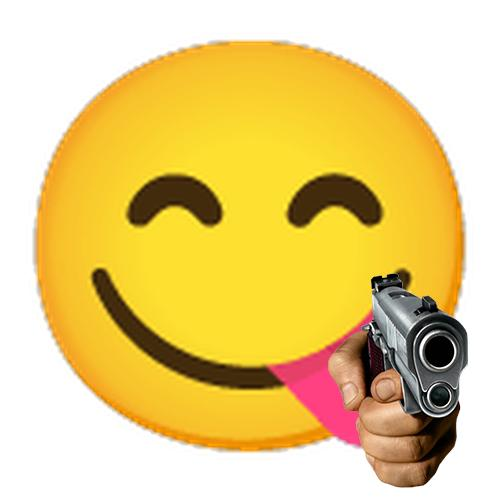

# 表情包列表

以下为内置表情的关键词、所需参数、等信息及表情预览

按照表情的 `key` 排列

## 5000choyen

- 关键词：`5000兆`
- 正则表达式：
- 需要图片数目：`0`
- 需要文字数目：`2`
- 默认文字：[`我去`, `洛天依`]
- 其他参数：
- 预览：

  

## addiction

- 关键词：`上瘾`、`毒瘾发作`
- 正则表达式：
- 需要图片数目：`1`
- 需要文字数目：`0` ~ `1`
- 默认文字：[]
- 其他参数：
- 预览：

  

## alike

- 关键词：`一样`
- 正则表达式：
- 需要图片数目：`1`
- 需要文字数目：`0`
- 默认文字：[]
- 其他参数：
- 预览：

  

## always

- 关键词：`一直`
- 正则表达式：
- 需要图片数目：`1`
- 需要文字数目：`0`
- 默认文字：[]
- 其他参数：
    - `mode`
        - 描述：生成模式，分为 `normal`(常规)、`circle`(套娃)、`loop`(循环套娃)
        - 类型：`string`
        - 默认值：`normal`
        - 可选值：`normal`、`loop`、`circle`
- 预览：
> 参数：{"mode": "normal"}

  

> 参数：{"mode": "circle"}

  

> 参数：{"mode": "loop"}

  

## always_like

- 关键词：`我永远喜欢`
- 正则表达式：
- 需要图片数目：`1` ~ `6`
- 需要文字数目：`0` ~ `6`
- 默认文字：[]
- 其他参数：
- 预览：

  

## anti_kidnap

- 关键词：`防诱拐`
- 正则表达式：
- 需要图片数目：`1`
- 需要文字数目：`0`
- 默认文字：[]
- 其他参数：
- 预览：

  

## anya_suki

- 关键词：`阿尼亚喜欢`
- 正则表达式：
- 需要图片数目：`1`
- 需要文字数目：`0` ~ `1`
- 默认文字：[`阿尼亚喜欢这个`]
- 其他参数：
- 预览：

  

## applaud

- 关键词：`鼓掌`
- 正则表达式：
- 需要图片数目：`1`
- 需要文字数目：`0`
- 默认文字：[]
- 其他参数：
- 预览：

  

## ascension

- 关键词：`升天`
- 正则表达式：
- 需要图片数目：`0`
- 需要文字数目：`1`
- 默认文字：[`学的是机械`]
- 其他参数：
- 预览：

  

## ask

- 关键词：`问问`
- 正则表达式：
- 需要图片数目：`1`
- 需要文字数目：`0` ~ `1`
- 默认文字：[]
- 其他参数：
- 预览：

  

## back_to_work

- 关键词：`继续干活`、`打工人`
- 正则表达式：
- 需要图片数目：`1`
- 需要文字数目：`0`
- 默认文字：[]
- 其他参数：
- 预览：

  

## bad_news

- 关键词：`悲报`
- 正则表达式：
- 需要图片数目：`0`
- 需要文字数目：`1`
- 默认文字：[`喜报`]
- 其他参数：
- 预览：

  

## bite

- 关键词：`啃`
- 正则表达式：
- 需要图片数目：`1`
- 需要文字数目：`0`
- 默认文字：[]
- 其他参数：
- 预览：

  

## blood_pressure

- 关键词：`高血压`
- 正则表达式：
- 需要图片数目：`1`
- 需要文字数目：`0`
- 默认文字：[]
- 其他参数：
- 预览：

  

## bocchi_draft

- 关键词：`波奇手稿`
- 正则表达式：
- 需要图片数目：`1`
- 需要文字数目：`0`
- 默认文字：[]
- 其他参数：
- 预览：

  

## bronya_holdsign

- 关键词：`大鸭鸭举牌`
- 正则表达式：
- 需要图片数目：`0`
- 需要文字数目：`1`
- 默认文字：[`V我50`]
- 其他参数：
- 预览：

  

## call_110

- 关键词：`遇到困难请拨打`
- 正则表达式：
- 需要图片数目：`2`
- 需要文字数目：`0`
- 默认文字：[]
- 其他参数：
- 预览：

  

## capoo_rub

- 关键词：`咖波蹭`、`咖波贴`
- 正则表达式：
- 需要图片数目：`1`
- 需要文字数目：`0`
- 默认文字：[]
- 其他参数：
- 预览：

  

## captain

- 关键词：`舰长`
- 正则表达式：
- 需要图片数目：`2` ~ `5`
- 需要文字数目：`0`
- 默认文字：[]
- 其他参数：
- 预览：

  

## chanshenzi

- 关键词：`馋身子`
- 正则表达式：
- 需要图片数目：`0`
- 需要文字数目：`3`
- 默认文字：[`你那叫喜欢吗？`, `你那是馋她身子`, `你下贱！`]
- 其他参数：
- 预览：

  

## charpic

- 关键词：`字符画`
- 正则表达式：
- 需要图片数目：`1`
- 需要文字数目：`0`
- 默认文字：[]
- 其他参数：
- 预览：

  

## chase_train

- 关键词：`追列车`、`追火车`
- 正则表达式：
- 需要图片数目：`1`
- 需要文字数目：`0`
- 默认文字：[]
- 其他参数：
- 预览：

  

## china_flag

- 关键词：`国旗`
- 正则表达式：
- 需要图片数目：`1`
- 需要文字数目：`0`
- 默认文字：[]
- 其他参数：
- 预览：

  

## confuse

- 关键词：`迷惑`
- 正则表达式：
- 需要图片数目：`1`
- 需要文字数目：`0`
- 默认文字：[]
- 其他参数：
- 预览：

  

## coupon

- 关键词：`兑换券`
- 正则表达式：
- 需要图片数目：`1`
- 需要文字数目：`0` ~ `1`
- 默认文字：[]
- 其他参数：
- 预览：

  

## cover_face

- 关键词：`捂脸`
- 正则表达式：
- 需要图片数目：`1`
- 需要文字数目：`0`
- 默认文字：[]
- 其他参数：
- 预览：

  

## crawl

- 关键词：`爬`
- 正则表达式：
- 需要图片数目：`1`
- 需要文字数目：`0`
- 默认文字：[]
- 其他参数：
    - `number`
        - 描述：指定“爬”使用的图片编号，范围为 1~92
        - 类型：`integer`
        - 默认值：`0`
- 预览：

  

## cyan

- 关键词：`群青`
- 正则表达式：
- 需要图片数目：`1`
- 需要文字数目：`0`
- 默认文字：[]
- 其他参数：
- 预览：

  

## decent_kiss

- 关键词：`像样的亲亲`
- 正则表达式：
- 需要图片数目：`1`
- 需要文字数目：`0`
- 默认文字：[]
- 其他参数：
- 预览：

  

## dianzhongdian

- 关键词：`入典`、`典中典`、`黑白草图`
- 正则表达式：
- 需要图片数目：`1`
- 需要文字数目：`1` ~ `2`
- 默认文字：[`救命啊`]
- 其他参数：
- 预览：

  

## dinosaur

- 关键词：`恐龙`、`小恐龙`
- 正则表达式：
- 需要图片数目：`1`
- 需要文字数目：`0`
- 默认文字：[]
- 其他参数：
- 预览：

  

## distracted

- 关键词：`注意力涣散`
- 正则表达式：
- 需要图片数目：`1`
- 需要文字数目：`0`
- 默认文字：[]
- 其他参数：
- 预览：

  

## divorce

- 关键词：`离婚协议`、`离婚申请`
- 正则表达式：
- 需要图片数目：`1`
- 需要文字数目：`0`
- 默认文字：[]
- 其他参数：
- 预览：

  

## dont_touch

- 关键词：`不要靠近`
- 正则表达式：
- 需要图片数目：`1`
- 需要文字数目：`0`
- 默认文字：[]
- 其他参数：
- 预览：

  

## douyin

- 关键词：`douyin`
- 正则表达式：
- 需要图片数目：`0`
- 需要文字数目：`1`
- 默认文字：[`douyin`]
- 其他参数：
- 预览：

  

## eat

- 关键词：`吃`
- 正则表达式：
- 需要图片数目：`1`
- 需要文字数目：`0`
- 默认文字：[]
- 其他参数：
- 预览：

  

## fanatic

- 关键词：`狂爱`、`狂粉`
- 正则表达式：
- 需要图片数目：`0`
- 需要文字数目：`1`
- 默认文字：[`洛天依`]
- 其他参数：
- 预览：

  

## fencing

- 关键词：`击剑`、`🤺`
- 正则表达式：
- 需要图片数目：`2`
- 需要文字数目：`0`
- 默认文字：[]
- 其他参数：
- 预览：

  

## find_chips

- 关键词：`整点薯条`
- 正则表达式：
- 需要图片数目：`0`
- 需要文字数目：`4`
- 默认文字：[`我们要飞向何方`, `我打算待会去码头整点薯条`, `我说的是归根结底，活着是为了什么`, `为了待会去码头整点薯条`]
- 其他参数：
- 预览：

  

## follow

- 关键词：`关注`
- 正则表达式：
- 需要图片数目：`1`
- 需要文字数目：`0` ~ `1`
- 默认文字：[]
- 其他参数：
- 预览：

  

## funny_mirror

- 关键词：`哈哈镜`
- 正则表达式：
- 需要图片数目：`1`
- 需要文字数目：`0`
- 默认文字：[]
- 其他参数：
- 预览：

  

## garbage

- 关键词：`垃圾`、`垃圾桶`
- 正则表达式：
- 需要图片数目：`1`
- 需要文字数目：`0`
- 默认文字：[]
- 其他参数：
- 预览：

  

## good_news

- 关键词：`喜报`
- 正则表达式：
- 需要图片数目：`0`
- 需要文字数目：`1`
- 默认文字：[`悲报`]
- 其他参数：
- 预览：

  

## google

- 关键词：`google`
- 正则表达式：
- 需要图片数目：`0`
- 需要文字数目：`1`
- 默认文字：[`Google`]
- 其他参数：
- 预览：

  

## gun

- 关键词：`手枪`
- 正则表达式：
- 需要图片数目：`1`
- 需要文字数目：`0`
- 默认文字：[]
- 其他参数：
- 预览：

  

## hammer

- 关键词：`锤`
- 正则表达式：
- 需要图片数目：`1`
- 需要文字数目：`0`
- 默认文字：[]
- 其他参数：
- 预览：

  

## high_EQ

- 关键词：`低情商xx高情商xx`
- 正则表达式：`低情商[\s:：]*(.*?)\s+高情商[\s:：]*(.*)`
- 需要图片数目：`0`
- 需要文字数目：`2`
- 默认文字：[`高情商`, `低情商`]
- 其他参数：
- 预览：

  

## hit_screen

- 关键词：`打穿`、`打穿屏幕`
- 正则表达式：
- 需要图片数目：`1`
- 需要文字数目：`0`
- 默认文字：[]
- 其他参数：
- 预览：

  

## hold_grudge

- 关键词：`记仇`
- 正则表达式：
- 需要图片数目：`0`
- 需要文字数目：`1`
- 默认文字：[`群友不发涩图`]
- 其他参数：
- 预览：

  

## hold_tight

- 关键词：`抱紧`
- 正则表达式：
- 需要图片数目：`1`
- 需要文字数目：`0`
- 默认文字：[]
- 其他参数：
- 预览：

  

## hug_leg

- 关键词：`抱大腿`
- 正则表达式：
- 需要图片数目：`1`
- 需要文字数目：`0`
- 默认文字：[]
- 其他参数：
- 预览：

  

## hutao_bite

- 关键词：`胡桃啃`
- 正则表达式：
- 需要图片数目：`1`
- 需要文字数目：`0`
- 默认文字：[]
- 其他参数：
- 预览：

  

## imprison

- 关键词：`坐牢`
- 正则表达式：
- 需要图片数目：`0`
- 需要文字数目：`1`
- 默认文字：[`我发涩图被抓起来了`]
- 其他参数：
- 预览：

  

## incivilization

- 关键词：`不文明`
- 正则表达式：
- 需要图片数目：`1`
- 需要文字数目：`0` ~ `1`
- 默认文字：[`你刚才说的话不是很礼貌！`]
- 其他参数：
- 预览：

  

## interview

- 关键词：`采访`
- 正则表达式：
- 需要图片数目：`1` ~ `2`
- 需要文字数目：`0` ~ `1`
- 默认文字：[`采访大佬经验`]
- 其他参数：
- 预览：

  

## jiji_king

- 关键词：`急急国王`
- 正则表达式：
- 需要图片数目：`1` ~ `11`
- 需要文字数目：`0` ~ `11`
- 默认文字：[]
- 其他参数：
    - `circle`
        - 描述：是否将图片变为圆形
        - 类型：`boolean`
        - 默认值：`False`
- 预览：
> 参数：{"circle": false}

  

> 参数：{"circle": true}

  

## jiujiu

- 关键词：`啾啾`
- 正则表达式：
- 需要图片数目：`1`
- 需要文字数目：`0`
- 默认文字：[]
- 其他参数：
- 预览：

  

## kaleidoscope

- 关键词：`万花筒`、`万花镜`
- 正则表达式：
- 需要图片数目：`1`
- 需要文字数目：`0`
- 默认文字：[]
- 其他参数：
    - `circle`
        - 描述：是否将图片变为圆形
        - 类型：`boolean`
        - 默认值：`False`
- 预览：
> 参数：{"circle": false}

  

> 参数：{"circle": true}

  

## karyl_point

- 关键词：`凯露指`
- 正则表达式：
- 需要图片数目：`1`
- 需要文字数目：`0`
- 默认文字：[]
- 其他参数：
- 预览：

  

## keep_away

- 关键词：`远离`
- 正则表达式：
- 需要图片数目：`1` ~ `8`
- 需要文字数目：`0` ~ `1`
- 默认文字：[`如何提高社交质量 : 
远离以下头像的人`]
- 其他参数：
- 预览：

  

## kick_ball

- 关键词：`踢球`
- 正则表达式：
- 需要图片数目：`1`
- 需要文字数目：`0`
- 默认文字：[]
- 其他参数：
- 预览：

  

## kirby_hammer

- 关键词：`卡比锤`、`卡比重锤`
- 正则表达式：
- 需要图片数目：`1`
- 需要文字数目：`0`
- 默认文字：[]
- 其他参数：
    - `circle`
        - 描述：是否将图片变为圆形
        - 类型：`boolean`
        - 默认值：`False`
- 预览：
> 参数：{"circle": false}

  

> 参数：{"circle": true}

  

## kiss

- 关键词：`亲`、`亲亲`
- 正则表达式：
- 需要图片数目：`2`
- 需要文字数目：`0`
- 默认文字：[]
- 其他参数：
- 预览：

  

## klee_eat

- 关键词：`可莉吃`
- 正则表达式：
- 需要图片数目：`1`
- 需要文字数目：`0`
- 默认文字：[]
- 其他参数：
- 预览：

  

## knock

- 关键词：`敲`
- 正则表达式：
- 需要图片数目：`1`
- 需要文字数目：`0`
- 默认文字：[]
- 其他参数：
- 预览：

  

## learn

- 关键词：`偷学`
- 正则表达式：
- 需要图片数目：`1`
- 需要文字数目：`0` ~ `1`
- 默认文字：[`偷学群友数理基础`]
- 其他参数：
- 预览：

  

## lim_x_0

- 关键词：`等价无穷小`
- 正则表达式：
- 需要图片数目：`1`
- 需要文字数目：`0`
- 默认文字：[]
- 其他参数：
- 预览：

  

## listen_music

- 关键词：`听音乐`
- 正则表达式：
- 需要图片数目：`1`
- 需要文字数目：`0`
- 默认文字：[]
- 其他参数：
- 预览：

  

## little_angel

- 关键词：`小天使`
- 正则表达式：
- 需要图片数目：`1`
- 需要文字数目：`0` ~ `1`
- 默认文字：[]
- 其他参数：
- 预览：

  

## loading

- 关键词：`加载中`
- 正则表达式：
- 需要图片数目：`1`
- 需要文字数目：`0`
- 默认文字：[]
- 其他参数：
- 预览：

  

## look_flat

- 关键词：`看扁`
- 正则表达式：
- 需要图片数目：`1`
- 需要文字数目：`0` ~ `1`
- 默认文字：[`可恶...被人看扁了`]
- 其他参数：
    - `ratio`
        - 描述：图片“压扁”比例
        - 类型：`integer`
        - 默认值：`2`
- 预览：

  

## look_this_icon

- 关键词：`看图标`
- 正则表达式：
- 需要图片数目：`1`
- 需要文字数目：`0` ~ `1`
- 默认文字：[`朋友
先看看这个图标再说话`]
- 其他参数：
- 预览：

  

## love_you

- 关键词：`永远爱你`
- 正则表达式：
- 需要图片数目：`1`
- 需要文字数目：`0`
- 默认文字：[]
- 其他参数：
- 预览：

  

## luxun_say

- 关键词：`鲁迅说`、`鲁迅说过`
- 正则表达式：
- 需要图片数目：`0`
- 需要文字数目：`1`
- 默认文字：[`我没有说过这句话`]
- 其他参数：
- 预览：

  

## make_friend

- 关键词：`交个朋友`
- 正则表达式：
- 需要图片数目：`1`
- 需要文字数目：`0` ~ `1`
- 默认文字：[]
- 其他参数：
- 预览：

  

## marriage

- 关键词：`结婚申请`、`结婚登记`
- 正则表达式：
- 需要图片数目：`1`
- 需要文字数目：`0`
- 默认文字：[]
- 其他参数：
- 预览：

  

## meteor

- 关键词：`流星`
- 正则表达式：
- 需要图片数目：`0`
- 需要文字数目：`1`
- 默认文字：[`我要对象`]
- 其他参数：
- 预览：

  

## murmur

- 关键词：`低语`
- 正则表达式：
- 需要图片数目：`0`
- 需要文字数目：`1`
- 默认文字：[`你的假期余额不足`]
- 其他参数：
- 预览：

  

## my_friend

- 关键词：`我朋友说`
- 正则表达式：
- 需要图片数目：`1`
- 需要文字数目：`1` ~ `10`
- 默认文字：[`让我康康`]
- 其他参数：
    - `name`
        - 描述：指定名字
        - 类型：`string`
        - 默认值：``
- 预览：

  

## my_wife

- 关键词：`我老婆`、`这是我老婆`
- 正则表达式：
- 需要图片数目：`1`
- 需要文字数目：`0`
- 默认文字：[]
- 其他参数：
- 预览：

  

## name_generator

- 关键词：`亚文化取名机`、`亚名`
- 正则表达式：
- 需要图片数目：`1`
- 需要文字数目：`0`
- 默认文字：[]
- 其他参数：
- 预览：

  

## need

- 关键词：`需要`、`你可能需要`
- 正则表达式：
- 需要图片数目：`1`
- 需要文字数目：`0`
- 默认文字：[]
- 其他参数：
- 预览：

  

## nihaosaoa

- 关键词：`你好骚啊`
- 正则表达式：
- 需要图片数目：`0`
- 需要文字数目：`3`
- 默认文字：[`既然追求刺激`, `就贯彻到底了`, `你好骚啊`]
- 其他参数：
- 预览：

  

## no_response

- 关键词：`无响应`
- 正则表达式：
- 需要图片数目：`1`
- 需要文字数目：`0`
- 默认文字：[]
- 其他参数：
- 预览：

  

## nokia

- 关键词：`诺基亚`、`有内鬼`
- 正则表达式：
- 需要图片数目：`0`
- 需要文字数目：`1`
- 默认文字：[`无内鬼，继续交易`]
- 其他参数：
- 预览：

  

## not_call_me

- 关键词：`不喊我`
- 正则表达式：
- 需要图片数目：`0`
- 需要文字数目：`1`
- 默认文字：[`开银趴不喊我是吧`]
- 其他参数：
- 预览：

  

## overtime

- 关键词：`加班`
- 正则表达式：
- 需要图片数目：`1`
- 需要文字数目：`0`
- 默认文字：[]
- 其他参数：
- 预览：

  

## paint

- 关键词：`这像画吗`
- 正则表达式：
- 需要图片数目：`1`
- 需要文字数目：`0`
- 默认文字：[]
- 其他参数：
- 预览：

  

## painter

- 关键词：`小画家`
- 正则表达式：
- 需要图片数目：`1`
- 需要文字数目：`0`
- 默认文字：[]
- 其他参数：
- 预览：

  

## pat

- 关键词：`拍`
- 正则表达式：
- 需要图片数目：`1`
- 需要文字数目：`0`
- 默认文字：[]
- 其他参数：
- 预览：

  

## perfect

- 关键词：`完美`
- 正则表达式：
- 需要图片数目：`1`
- 需要文字数目：`0`
- 默认文字：[]
- 其他参数：
- 预览：

  

## petpet

- 关键词：`摸`、`摸摸`、`摸头`、`rua`
- 正则表达式：
- 需要图片数目：`1`
- 需要文字数目：`0`
- 默认文字：[]
- 其他参数：
    - `circle`
        - 描述：是否将图片变为圆形
        - 类型：`boolean`
        - 默认值：`False`
- 预览：
> 参数：{"circle": false}

  

> 参数：{"circle": true}

  

## play

- 关键词：`顶`、`玩`
- 正则表达式：
- 需要图片数目：`1`
- 需要文字数目：`0`
- 默认文字：[]
- 其他参数：
- 预览：

  

## play_game

- 关键词：`玩游戏`
- 正则表达式：
- 需要图片数目：`1`
- 需要文字数目：`0` ~ `1`
- 默认文字：[`来玩休闲游戏啊`]
- 其他参数：
- 预览：

  

## police

- 关键词：`出警`
- 正则表达式：
- 需要图片数目：`1`
- 需要文字数目：`0`
- 默认文字：[]
- 其他参数：
- 预览：

  

## police1

- 关键词：`警察`
- 正则表达式：
- 需要图片数目：`1`
- 需要文字数目：`0`
- 默认文字：[]
- 其他参数：
- 预览：

  

## pornhub

- 关键词：`ph`、`pornhub`
- 正则表达式：
- 需要图片数目：`0`
- 需要文字数目：`2`
- 默认文字：[`You`, `Tube`]
- 其他参数：
- 预览：

  

## potato

- 关键词：`土豆`
- 正则表达式：
- 需要图片数目：`1`
- 需要文字数目：`0`
- 默认文字：[]
- 其他参数：
- 预览：

  

## pound

- 关键词：`捣`
- 正则表达式：
- 需要图片数目：`1`
- 需要文字数目：`0`
- 默认文字：[]
- 其他参数：
- 预览：

  

## printing

- 关键词：`打印`
- 正则表达式：
- 需要图片数目：`1`
- 需要文字数目：`0`
- 默认文字：[]
- 其他参数：
- 预览：

  

## prpr

- 关键词：`舔`、`舔屏`、`prpr`
- 正则表达式：
- 需要图片数目：`1`
- 需要文字数目：`0`
- 默认文字：[]
- 其他参数：
- 预览：

  

## psyduck

- 关键词：`可达鸭`
- 正则表达式：
- 需要图片数目：`0`
- 需要文字数目：`2`
- 默认文字：[`来份`, `涩图`]
- 其他参数：
- 预览：

  

## punch

- 关键词：`打拳`
- 正则表达式：
- 需要图片数目：`1`
- 需要文字数目：`0`
- 默认文字：[]
- 其他参数：
- 预览：

  

## qiegewala

- 关键词：`切格瓦拉`
- 正则表达式：
- 需要图片数目：`0`
- 需要文字数目：`6`
- 默认文字：[`没有钱啊 肯定要做的啊`, `不做的话没有钱用`, `那你不会去打工啊`, `有手有脚的`, `打工是不可能打工的`, `这辈子不可能打工的`]
- 其他参数：
- 预览：

  

## raise_sign

- 关键词：`举牌`
- 正则表达式：
- 需要图片数目：`0`
- 需要文字数目：`1`
- 默认文字：[`大佬带带我`]
- 其他参数：
- 预览：

  

## read_book

- 关键词：`看书`
- 正则表达式：
- 需要图片数目：`1`
- 需要文字数目：`0`
- 默认文字：[]
- 其他参数：
- 预览：

  

## repeat

- 关键词：`复读`
- 正则表达式：
- 需要图片数目：`1` ~ `5`
- 需要文字数目：`1`
- 默认文字：[`救命啊`]
- 其他参数：
- 预览：

  

## rip

- 关键词：`撕`
- 正则表达式：
- 需要图片数目：`1` ~ `2`
- 需要文字数目：`0`
- 默认文字：[]
- 其他参数：
- 预览：

  

## rip_angrily

- 关键词：`怒撕`
- 正则表达式：
- 需要图片数目：`1`
- 需要文字数目：`0`
- 默认文字：[]
- 其他参数：
- 预览：

  

## rise_dead

- 关键词：`诈尸`、`秽土转生`
- 正则表达式：
- 需要图片数目：`1`
- 需要文字数目：`0`
- 默认文字：[]
- 其他参数：
- 预览：

  

## roll

- 关键词：`滚`
- 正则表达式：
- 需要图片数目：`1`
- 需要文字数目：`0`
- 默认文字：[]
- 其他参数：
- 预览：

  

## rub

- 关键词：`贴`、`贴贴`、`蹭`、`蹭蹭`
- 正则表达式：
- 需要图片数目：`2`
- 需要文字数目：`0`
- 默认文字：[]
- 其他参数：
- 预览：

  

## run

- 关键词：`快跑`
- 正则表达式：
- 需要图片数目：`0`
- 需要文字数目：`1`
- 默认文字：[`快跑`]
- 其他参数：
- 预览：

  

## safe_sense

- 关键词：`安全感`
- 正则表达式：
- 需要图片数目：`1`
- 需要文字数目：`0` ~ `1`
- 默认文字：[`你给我的安全感
远不及它的万分之一`]
- 其他参数：
- 预览：

  

## scratch_head

- 关键词：`挠头`
- 正则表达式：
- 需要图片数目：`1`
- 需要文字数目：`0`
- 默认文字：[]
- 其他参数：
- 预览：

  

## scratchcard

- 关键词：`刮刮乐`
- 正则表达式：
- 需要图片数目：`0`
- 需要文字数目：`1`
- 默认文字：[`谢谢参与`]
- 其他参数：
- 预览：

  

## scroll

- 关键词：`滚屏`
- 正则表达式：
- 需要图片数目：`0`
- 需要文字数目：`1`
- 默认文字：[`你们说话啊`]
- 其他参数：
- 预览：

  

## shishilani

- 关键词：`食屎啦你`
- 正则表达式：
- 需要图片数目：`0`
- 需要文字数目：`4`
- 默认文字：[`穿西装打领带`, `拿大哥大有什么用`, `跟着这样的大哥`, `食屎啦你`]
- 其他参数：
- 预览：

  

## shock

- 关键词：`震惊`
- 正则表达式：
- 需要图片数目：`1`
- 需要文字数目：`0`
- 默认文字：[]
- 其他参数：
- 预览：

  

## shuifandui

- 关键词：`谁反对`
- 正则表达式：
- 需要图片数目：`0`
- 需要文字数目：`4`
- 默认文字：[`我话说完了`, `谁赞成`, `谁反对`, `我反对`]
- 其他参数：
- 预览：

  

## shutup

- 关键词：`别说了`
- 正则表达式：
- 需要图片数目：`0`
- 需要文字数目：`1`
- 默认文字：[`你不要再说了`]
- 其他参数：
- 预览：

  

## sit_still

- 关键词：`坐得住`、`坐的住`
- 正则表达式：
- 需要图片数目：`1`
- 需要文字数目：`0` ~ `1`
- 默认文字：[]
- 其他参数：
- 预览：

  

## slap

- 关键词：`一巴掌`
- 正则表达式：
- 需要图片数目：`0`
- 需要文字数目：`1`
- 默认文字：[]
- 其他参数：
- 预览：

  

## slogan

- 关键词：`口号`
- 正则表达式：
- 需要图片数目：`0`
- 需要文字数目：`6`
- 默认文字：[`我们是谁？`, `浙大人！`, `到浙大来做什么？`, `混！`, `将来毕业后要做什么样的人？`, `混混！`]
- 其他参数：
- 预览：

  

## smash

- 关键词：`砸`
- 正则表达式：
- 需要图片数目：`1`
- 需要文字数目：`0`
- 默认文字：[]
- 其他参数：
- 预览：

  

## suck

- 关键词：`吸`、`嗦`
- 正则表达式：
- 需要图片数目：`1`
- 需要文字数目：`0`
- 默认文字：[]
- 其他参数：
- 预览：

  

## support

- 关键词：`精神支柱`
- 正则表达式：
- 需要图片数目：`1`
- 需要文字数目：`0`
- 默认文字：[]
- 其他参数：
- 预览：

  

## symmetric

- 关键词：`对称`
- 正则表达式：
- 需要图片数目：`1`
- 需要文字数目：`0`
- 默认文字：[]
- 其他参数：
    - `direction`
        - 描述：对称方向，可选值为 `left`(左)、`right`(右)、`top`(上)、`bottom`(下)
        - 类型：`string`
        - 默认值：`left`
        - 可选值：`left`、`right`、`top`、`bottom`
- 预览：
> 参数：{"direction": "left"}

  

> 参数：{"direction": "right"}

  

> 参数：{"direction": "top"}

  

> 参数：{"direction": "bottom"}

  

## tankuku_raisesign

- 关键词：`唐可可举牌`
- 正则表达式：
- 需要图片数目：`1`
- 需要文字数目：`0`
- 默认文字：[]
- 其他参数：
- 预览：

  

## teach

- 关键词：`讲课`、`敲黑板`
- 正则表达式：
- 需要图片数目：`1`
- 需要文字数目：`0` ~ `1`
- 默认文字：[`我老婆`]
- 其他参数：
- 预览：

  

## think_what

- 关键词：`想什么`
- 正则表达式：
- 需要图片数目：`1`
- 需要文字数目：`0`
- 默认文字：[]
- 其他参数：
- 预览：

  

## throw

- 关键词：`丢`、`扔`
- 正则表达式：
- 需要图片数目：`1`
- 需要文字数目：`0`
- 默认文字：[]
- 其他参数：
- 预览：

  

## throw_gif

- 关键词：`抛`、`掷`
- 正则表达式：
- 需要图片数目：`1`
- 需要文字数目：`0`
- 默认文字：[]
- 其他参数：
- 预览：

  

## thump

- 关键词：`捶`
- 正则表达式：
- 需要图片数目：`1`
- 需要文字数目：`0`
- 默认文字：[]
- 其他参数：
- 预览：

  

## tightly

- 关键词：`紧贴`、`紧紧贴着`
- 正则表达式：
- 需要图片数目：`1`
- 需要文字数目：`0`
- 默认文字：[]
- 其他参数：
- 预览：

  

## together

- 关键词：`一起`
- 正则表达式：
- 需要图片数目：`1`
- 需要文字数目：`0` ~ `1`
- 默认文字：[]
- 其他参数：
- 预览：

  

## trance

- 关键词：`恍惚`
- 正则表达式：
- 需要图片数目：`1`
- 需要文字数目：`0`
- 默认文字：[]
- 其他参数：
- 预览：

  

## turn

- 关键词：`转`
- 正则表达式：
- 需要图片数目：`1`
- 需要文字数目：`0`
- 默认文字：[]
- 其他参数：
- 预览：

  

## twist

- 关键词：`搓`
- 正则表达式：
- 需要图片数目：`1`
- 需要文字数目：`0`
- 默认文字：[]
- 其他参数：
- 预览：

  

## universal

- 关键词：`万能表情`、`空白表情`
- 正则表达式：
- 需要图片数目：`1`
- 需要文字数目：`1` ~ `10`
- 默认文字：[`在此处添加文字`]
- 其他参数：
- 预览：

  

## wakeup

- 关键词：`xx起来了`
- 正则表达式：`(.*?)\s+起来了`
- 需要图片数目：`0`
- 需要文字数目：`1`
- 默认文字：[`好`]
- 其他参数：
- 预览：

  

## wallpaper

- 关键词：`墙纸`
- 正则表达式：
- 需要图片数目：`1`
- 需要文字数目：`0`
- 默认文字：[]
- 其他参数：
- 预览：

  

## walnut_pad

- 关键词：`胡桃平板`
- 正则表达式：
- 需要图片数目：`1`
- 需要文字数目：`0`
- 默认文字：[]
- 其他参数：
- 预览：

  

## walnut_zoom

- 关键词：`胡桃放大`
- 正则表达式：
- 需要图片数目：`1`
- 需要文字数目：`0`
- 默认文字：[]
- 其他参数：
- 预览：

  

## wangjingze

- 关键词：`王境泽`
- 正则表达式：
- 需要图片数目：`0`
- 需要文字数目：`4`
- 默认文字：[`我就是饿死`, `死外边 从这里跳下去`, `不会吃你们一点东西`, `真香`]
- 其他参数：
- 预览：

  

## wave

- 关键词：`波纹`
- 正则表达式：
- 需要图片数目：`1`
- 需要文字数目：`0`
- 默认文字：[]
- 其他参数：
- 预览：

  

## weisuoyuwei

- 关键词：`为所欲为`
- 正则表达式：
- 需要图片数目：`0`
- 需要文字数目：`9`
- 默认文字：[`好啊`, `就算你是一流工程师`, `就算你出报告再完美`, `我叫你改报告你就要改`, `毕竟我是客户`, `客户了不起啊`, `Sorry 客户真的了不起`, `以后叫他天天改报告`, `天天改 天天改`]
- 其他参数：
- 预览：

  

## why_at_me

- 关键词：`为什么@我`
- 正则表达式：
- 需要图片数目：`1`
- 需要文字数目：`0`
- 默认文字：[]
- 其他参数：
- 预览：

  

## windmill_turn

- 关键词：`风车转`
- 正则表达式：
- 需要图片数目：`1`
- 需要文字数目：`0`
- 默认文字：[]
- 其他参数：
- 预览：

  

## wish_fail

- 关键词：`许愿失败`
- 正则表达式：
- 需要图片数目：`0`
- 需要文字数目：`1`
- 默认文字：[`我要对象`]
- 其他参数：
- 预览：

  

## wooden_fish

- 关键词：`木鱼`
- 正则表达式：
- 需要图片数目：`1`
- 需要文字数目：`0`
- 默认文字：[]
- 其他参数：
- 预览：

  

## worship

- 关键词：`膜`、`膜拜`
- 正则表达式：
- 需要图片数目：`1`
- 需要文字数目：`0`
- 默认文字：[]
- 其他参数：
- 预览：

  

## wujing

- 关键词：`吴京`
- 正则表达式：`吴京[\s:：]*(.*?)中国(.*)`
- 需要图片数目：`0`
- 需要文字数目：`2`
- 默认文字：[`不买华为不是`, `人`]
- 其他参数：
- 预览：

  

## wunian

- 关键词：`五年怎么过的`
- 正则表达式：
- 需要图片数目：`0`
- 需要文字数目：`4`
- 默认文字：[`五年`, `你知道我这五年是怎么过的吗`, `我每天躲在家里玩贪玩蓝月`, `你知道有多好玩吗`]
- 其他参数：
- 预览：

  

## yalidaye

- 关键词：`压力大爷`
- 正则表达式：
- 需要图片数目：`0`
- 需要文字数目：`3`
- 默认文字：[`外界都说我们压力大`, `我觉得吧压力也没有那么大`, `主要是28岁了还没媳妇儿`]
- 其他参数：
- 预览：

  

## youtube

- 关键词：`yt`、`youtube`
- 正则表达式：
- 需要图片数目：`0`
- 需要文字数目：`2`
- 默认文字：[`Porn`, `Hub`]
- 其他参数：
- 预览：

  

## zengxiaoxian

- 关键词：`曾小贤`
- 正则表达式：
- 需要图片数目：`0`
- 需要文字数目：`4`
- 默认文字：[`平时你打电子游戏吗`, `偶尔`, `星际还是魔兽`, `连连看`]
- 其他参数：
- 预览：

  

