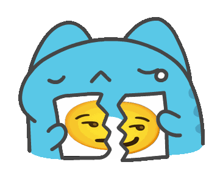

# 表情列表

以下为内置表情的关键词、所需参数等信息及表情预览

按照表情的 `key` 排列


1. [5000choyen (5000兆)](#5000choyen)
2. [acg_entrance (二次元入口)](#acg_entrance)
3. [addiction (上瘾/毒瘾发作)](#addiction)
4. [alike (一样)](#alike)
5. [always (一直)](#always)
6. [always_like (我永远喜欢)](#always_like)
7. [anti_kidnap (防诱拐)](#anti_kidnap)
8. [anya_suki (阿尼亚喜欢)](#anya_suki)
9. [applaud (鼓掌)](#applaud)
10. [ascension (升天)](#ascension)
11. [ask (问问)](#ask)
12. [back_to_work (继续干活/打工人)](#back_to_work)
13. [bad_news (悲报)](#bad_news)
14. [beat_head (拍头)](#beat_head)
15. [bite (啃)](#bite)
16. [blood_pressure (高血压)](#blood_pressure)
17. [bocchi_draft (波奇手稿)](#bocchi_draft)
18. [bronya_holdsign (布洛妮娅举牌/大鸭鸭举牌)](#bronya_holdsign)
19. [bubble_tea (奶茶)](#bubble_tea)
20. [call_110 (遇到困难请拨打)](#call_110)
21. [capoo_draw (咖波画)](#capoo_draw)
22. [capoo_rip (咖波撕)](#capoo_rip)
23. [capoo_rub (咖波蹭/咖波贴)](#capoo_rub)
24. [capoo_say (咖波说)](#capoo_say)
25. [capoo_strike (咖波撞/咖波头槌)](#capoo_strike)
26. [captain (舰长)](#captain)
27. [chanshenzi (馋身子)](#chanshenzi)
28. [charpic (字符画)](#charpic)
29. [chase_train (追列车/追火车)](#chase_train)
30. [china_flag (国旗)](#china_flag)
31. [confuse (迷惑)](#confuse)
32. [coupon (兑换券)](#coupon)
33. [cover_face (捂脸)](#cover_face)
34. [crawl (爬)](#crawl)
35. [cyan (群青)](#cyan)
36. [decent_kiss (像样的亲亲)](#decent_kiss)
37. [dianzhongdian (入典/典中典/黑白草图)](#dianzhongdian)
38. [dinosaur (恐龙/小恐龙)](#dinosaur)
39. [distracted (注意力涣散)](#distracted)
40. [divorce (离婚协议/离婚申请)](#divorce)
41. [dog_of_vtb (管人痴)](#dog_of_vtb)
42. [dont_go_near (不要靠近)](#dont_go_near)
43. [douyin (douyin)](#douyin)
44. [eat (吃)](#eat)
45. [fanatic (狂爱/狂粉)](#fanatic)
46. [fencing (击剑/🤺)](#fencing)
47. [find_chips (整点薯条)](#find_chips)
48. [follow (关注)](#follow)
49. [funny_mirror (哈哈镜)](#funny_mirror)
50. [garbage (垃圾/垃圾桶)](#garbage)
51. [good_news (喜报)](#good_news)
52. [google (google)](#google)
53. [gun (手枪)](#gun)
54. [hammer (锤)](#hammer)
55. [high_EQ (低情商xx高情商xx)](#high_EQ)
56. [hit_screen (打穿/打穿屏幕)](#hit_screen)
57. [hold_grudge (记仇)](#hold_grudge)
58. [hold_tight (抱紧)](#hold_tight)
59. [hug_leg (抱大腿)](#hug_leg)
60. [hutao_bite (胡桃啃)](#hutao_bite)
61. [imprison (坐牢)](#imprison)
62. [incivilization (不文明)](#incivilization)
63. [interview (采访)](#interview)
64. [jiji_king (急急国王)](#jiji_king)
65. [jiujiu (啾啾)](#jiujiu)
66. [kaleidoscope (万花筒/万花镜)](#kaleidoscope)
67. [karyl_point (凯露指)](#karyl_point)
68. [keep_away (远离)](#keep_away)
69. [kick_ball (踢球)](#kick_ball)
70. [kirby_hammer (卡比锤/卡比重锤)](#kirby_hammer)
71. [kiss (亲/亲亲)](#kiss)
72. [klee_eat (可莉吃)](#klee_eat)
73. [knock (敲)](#knock)
74. [learn (偷学)](#learn)
75. [lim_x_0 (等价无穷小)](#lim_x_0)
76. [listen_music (听音乐)](#listen_music)
77. [little_angel (小天使)](#little_angel)
78. [loading (加载中)](#loading)
79. [look_flat (看扁)](#look_flat)
80. [look_this_icon (看图标)](#look_this_icon)
81. [love_you (永远爱你)](#love_you)
82. [luoyonghao_say (罗永浩说)](#luoyonghao_say)
83. [luxun_say (鲁迅说/鲁迅说过)](#luxun_say)
84. [make_friend (交个朋友)](#make_friend)
85. [marriage (结婚申请/结婚登记)](#marriage)
86. [meteor (流星)](#meteor)
87. [murmur (低语)](#murmur)
88. [my_friend (我朋友说)](#my_friend)
89. [my_wife (我老婆/这是我老婆)](#my_wife)
90. [name_generator (亚文化取名机/亚名)](#name_generator)
91. [need (需要/你可能需要)](#need)
92. [nekoha_holdsign (猫羽雫举牌/猫猫举牌)](#nekoha_holdsign)
93. [nihaosaoa (你好骚啊)](#nihaosaoa)
94. [no_response (无响应)](#no_response)
95. [nokia (诺基亚/有内鬼)](#nokia)
96. [not_call_me (不喊我)](#not_call_me)
97. [note_for_leave (请假条)](#note_for_leave)
98. [overtime (加班)](#overtime)
99. [paint (这像画吗)](#paint)
100. [painter (小画家)](#painter)
101. [pass_the_buck (推锅/甩锅)](#pass_the_buck)
102. [pat (拍)](#pat)
103. [perfect (完美)](#perfect)
104. [petpet (摸/摸摸/摸头/rua)](#petpet)
105. [play (顶/玩)](#play)
106. [play_game (玩游戏)](#play_game)
107. [police (出警)](#police)
108. [police1 (警察)](#police1)
109. [pornhub (ph/pornhub)](#pornhub)
110. [potato (土豆)](#potato)
111. [pound (捣)](#pound)
112. [printing (打印)](#printing)
113. [prpr (舔/舔屏/prpr)](#prpr)
114. [psyduck (可达鸭)](#psyduck)
115. [punch (打拳)](#punch)
116. [qiegewala (切格瓦拉)](#qiegewala)
117. [raise_sign (举牌)](#raise_sign)
118. [read_book (看书)](#read_book)
119. [repeat (复读)](#repeat)
120. [rip (撕)](#rip)
121. [rip_angrily (怒撕)](#rip_angrily)
122. [rise_dead (诈尸/秽土转生)](#rise_dead)
123. [roll (滚)](#roll)
124. [rub (贴/贴贴/蹭/蹭蹭)](#rub)
125. [run (快跑)](#run)
126. [safe_sense (安全感)](#safe_sense)
127. [scratch_head (挠头)](#scratch_head)
128. [scratchcard (刮刮乐)](#scratchcard)
129. [scroll (滚屏)](#scroll)
130. [shishilani (食屎啦你)](#shishilani)
131. [shock (震惊)](#shock)
132. [shuifandui (谁反对)](#shuifandui)
133. [shutup (别说了)](#shutup)
134. [sit_still (坐得住/坐的住)](#sit_still)
135. [slap (一巴掌)](#slap)
136. [slogan (口号)](#slogan)
137. [smash (砸)](#smash)
138. [step_on (踩)](#step_on)
139. [suck (吸/嗦)](#suck)
140. [support (精神支柱)](#support)
141. [symmetric (对称)](#symmetric)
142. [tankuku_raisesign (唐可可举牌)](#tankuku_raisesign)
143. [teach (讲课/敲黑板)](#teach)
144. [think_what (想什么)](#think_what)
145. [throw (丢/扔)](#throw)
146. [throw_gif (抛/掷)](#throw_gif)
147. [thump (捶)](#thump)
148. [thump_wildly (捶爆/爆捶)](#thump_wildly)
149. [tightly (紧贴/紧紧贴着)](#tightly)
150. [together (一起)](#together)
151. [trance (恍惚)](#trance)
152. [turn (转)](#turn)
153. [twist (搓)](#twist)
154. [universal (万能表情/空白表情)](#universal)
155. [wakeup (xx起来了)](#wakeup)
156. [wallpaper (墙纸)](#wallpaper)
157. [walnut_pad (胡桃平板)](#walnut_pad)
158. [walnut_zoom (胡桃放大)](#walnut_zoom)
159. [wangjingze (王境泽)](#wangjingze)
160. [wave (波纹)](#wave)
161. [weisuoyuwei (为所欲为)](#weisuoyuwei)
162. [why_at_me (为什么@我)](#why_at_me)
163. [windmill_turn (风车转)](#windmill_turn)
164. [wish_fail (许愿失败)](#wish_fail)
165. [wooden_fish (木鱼)](#wooden_fish)
166. [worship (膜/膜拜)](#worship)
167. [wujing (吴京xx中国xx)](#wujing)
168. [wunian (五年怎么过的)](#wunian)
169. [yalidaye (压力大爷)](#yalidaye)
170. [youtube (yt/youtube)](#youtube)
171. [zengxiaoxian (曾小贤)](#zengxiaoxian)


## 5000choyen

- 关键词：`5000兆`
- 需要图片数目：`0`
- 需要文字数目：`2`
- 默认文字：[`我去`, `洛天依`]
- 预览：
<div align="left">
  
</div>

## acg_entrance

- 关键词：`二次元入口`
- 需要图片数目：`1`
- 需要文字数目：`0` ~ `1`
- 默认文字：[`走，跟我去二次元吧`]
- 预览：
<div align="left">
  
</div>

## addiction

- 关键词：`上瘾`、`毒瘾发作`
- 需要图片数目：`1`
- 需要文字数目：`0` ~ `1`
- 预览：
<div align="left">
  
</div>

## alike

- 关键词：`一样`
- 需要图片数目：`1`
- 需要文字数目：`0`
- 预览：
<div align="left">
  
</div>

## always

- 关键词：`一直`
- 需要图片数目：`1`
- 需要文字数目：`0`
- 其他参数：
    - `mode`
        - 描述：生成模式
        - 类型：`string`
        - 默认值：`normal`
        - 可选值：`normal`、`loop`、`circle`
- 其他参数（命令行选项）：
```shell
usage: meme generate always [-h] [--mode {normal,circle,loop} | --circle | --loop]

options:
  -h, --help            show this help message and exit
  --mode {normal,circle,loop}
                        生成模式
  --circle, /套娃
  --loop, /循环
```

- 预览：
> 参数：{"mode": "normal"}
<div align="left">
  
</div>

> 参数：{"mode": "circle"}
<div align="left">
  
</div>

> 参数：{"mode": "loop"}
<div align="left">
  
</div>

## always_like

- 关键词：`我永远喜欢`
- 需要图片数目：`1` ~ `6`
- 需要文字数目：`0` ~ `6`
- 预览：
<div align="left">
  
</div>

## anti_kidnap

- 关键词：`防诱拐`
- 需要图片数目：`1`
- 需要文字数目：`0`
- 预览：
<div align="left">
  
</div>

## anya_suki

- 关键词：`阿尼亚喜欢`
- 需要图片数目：`1`
- 需要文字数目：`0` ~ `1`
- 默认文字：[`阿尼亚喜欢这个`]
- 预览：
<div align="left">
  
</div>

## applaud

- 关键词：`鼓掌`
- 需要图片数目：`1`
- 需要文字数目：`0`
- 预览：
<div align="left">
  
</div>

## ascension

- 关键词：`升天`
- 需要图片数目：`0`
- 需要文字数目：`1`
- 默认文字：[`学的是机械`]
- 预览：
<div align="left">
  
</div>

## ask

- 关键词：`问问`
- 需要图片数目：`1`
- 需要文字数目：`0` ~ `1`
- 预览：
<div align="left">
  
</div>

## back_to_work

- 关键词：`继续干活`、`打工人`
- 需要图片数目：`1`
- 需要文字数目：`0`
- 预览：
<div align="left">
  
</div>

## bad_news

- 关键词：`悲报`
- 需要图片数目：`0`
- 需要文字数目：`1`
- 默认文字：[`喜报`]
- 预览：
<div align="left">
  
</div>

## beat_head

- 关键词：`拍头`
- 需要图片数目：`1`
- 需要文字数目：`0` ~ `1`
- 预览：
<div align="left">
  
</div>

## bite

- 关键词：`啃`
- 需要图片数目：`1`
- 需要文字数目：`0`
- 预览：
<div align="left">
  
</div>

## blood_pressure

- 关键词：`高血压`
- 需要图片数目：`1`
- 需要文字数目：`0`
- 预览：
<div align="left">
  
</div>

## bocchi_draft

- 关键词：`波奇手稿`
- 需要图片数目：`1`
- 需要文字数目：`0`
- 预览：
<div align="left">
  
</div>

## bronya_holdsign

- 关键词：`布洛妮娅举牌`、`大鸭鸭举牌`
- 需要图片数目：`0`
- 需要文字数目：`1`
- 默认文字：[`V我50`]
- 预览：
<div align="left">
  
</div>

## bubble_tea

- 关键词：`奶茶`
- 需要图片数目：`1`
- 需要文字数目：`0`
- 其他参数：
    - `position`
        - 描述：奶茶的位置
        - 类型：`string`
        - 默认值：`right`
        - 可选值：`right`、`left`、`both`
- 其他参数（命令行选项）：
```shell
usage: meme generate bubble_tea [-h] [-p {right,left,both} | --right | --left | --both]

options:
  -h, --help            show this help message and exit
  -p {right,left,both}, --position {right,left,both}
                        奶茶的位置
  --right, /右手
  --left, /左手
  --both, /双手
```

- 预览：
> 参数：{"position": "right"}
<div align="left">
  
</div>

> 参数：{"position": "left"}
<div align="left">
  
</div>

> 参数：{"position": "both"}
<div align="left">
  
</div>

## call_110

- 关键词：`遇到困难请拨打`
- 需要图片数目：`2`
- 需要文字数目：`0`
- 预览：
<div align="left">
  
</div>

## capoo_draw

- 关键词：`咖波画`
- 需要图片数目：`1`
- 需要文字数目：`0`
- 预览：
<div align="left">
  
</div>

## capoo_rip

- 关键词：`咖波撕`
- 需要图片数目：`1`
- 需要文字数目：`0`
- 预览：
<div align="left">
  
</div>

## capoo_rub

- 关键词：`咖波蹭`、`咖波贴`
- 需要图片数目：`1`
- 需要文字数目：`0`
- 预览：
<div align="left">
  
</div>

## capoo_say

- 关键词：`咖波说`
- 需要图片数目：`0`
- 需要文字数目：`1` ~ `10`
- 默认文字：[`寄`]
- 预览：
<div align="left">
  
</div>

## capoo_strike

- 关键词：`咖波撞`、`咖波头槌`
- 需要图片数目：`1`
- 需要文字数目：`0`
- 预览：
<div align="left">
  
</div>

## captain

- 关键词：`舰长`
- 需要图片数目：`2` ~ `5`
- 需要文字数目：`0`
- 预览：
<div align="left">
  
</div>

## chanshenzi

- 关键词：`馋身子`
- 需要图片数目：`0`
- 需要文字数目：`3`
- 默认文字：[`你那叫喜欢吗？`, `你那是馋她身子`, `你下贱！`]
- 预览：
<div align="left">
  
</div>

## charpic

- 关键词：`字符画`
- 需要图片数目：`1`
- 需要文字数目：`0`
- 预览：
<div align="left">
  
</div>

## chase_train

- 关键词：`追列车`、`追火车`
- 需要图片数目：`1`
- 需要文字数目：`0`
- 预览：
<div align="left">
  
</div>

## china_flag

- 关键词：`国旗`
- 需要图片数目：`1`
- 需要文字数目：`0`
- 预览：
<div align="left">
  
</div>

## confuse

- 关键词：`迷惑`
- 需要图片数目：`1`
- 需要文字数目：`0`
- 预览：
<div align="left">
  
</div>

## coupon

- 关键词：`兑换券`
- 需要图片数目：`1`
- 需要文字数目：`0` ~ `1`
- 预览：
<div align="left">
  
</div>

## cover_face

- 关键词：`捂脸`
- 需要图片数目：`1`
- 需要文字数目：`0`
- 预览：
<div align="left">
  
</div>

## crawl

- 关键词：`爬`
- 需要图片数目：`1`
- 需要文字数目：`0`
- 其他参数：
    - `number`
        - 描述：图片编号，范围为 1~92
        - 类型：`integer`
        - 默认值：`0`
- 其他参数（命令行选项）：
```shell
usage: meme generate crawl [-h] [-n NUMBER]

options:
  -h, --help            show this help message and exit
  -n NUMBER, --number NUMBER
                        图片编号，范围为 1~92
```

- 预览：
<div align="left">
  
</div>

## cyan

- 关键词：`群青`
- 需要图片数目：`1`
- 需要文字数目：`0`
- 预览：
<div align="left">
  
</div>

## decent_kiss

- 关键词：`像样的亲亲`
- 需要图片数目：`1`
- 需要文字数目：`0`
- 预览：
<div align="left">
  
</div>

## dianzhongdian

- 关键词：`入典`、`典中典`、`黑白草图`
- 需要图片数目：`1`
- 需要文字数目：`1` ~ `2`
- 默认文字：[`救命啊`]
- 预览：
<div align="left">
  
</div>

## dinosaur

- 关键词：`恐龙`、`小恐龙`
- 需要图片数目：`1`
- 需要文字数目：`0`
- 预览：
<div align="left">
  
</div>

## distracted

- 关键词：`注意力涣散`
- 需要图片数目：`1`
- 需要文字数目：`0`
- 预览：
<div align="left">
  
</div>

## divorce

- 关键词：`离婚协议`、`离婚申请`
- 需要图片数目：`1`
- 需要文字数目：`0`
- 预览：
<div align="left">
  
</div>

## dog_of_vtb

- 关键词：`管人痴`
- 需要图片数目：`1`
- 需要文字数目：`0`
- 预览：
<div align="left">
  
</div>

## dont_go_near

- 关键词：`不要靠近`
- 需要图片数目：`1`
- 需要文字数目：`0`
- 预览：
<div align="left">
  
</div>

## douyin

- 关键词：`douyin`
- 需要图片数目：`0`
- 需要文字数目：`1`
- 默认文字：[`douyin`]
- 预览：
<div align="left">
  
</div>

## eat

- 关键词：`吃`
- 需要图片数目：`1`
- 需要文字数目：`0`
- 预览：
<div align="left">
  
</div>

## fanatic

- 关键词：`狂爱`、`狂粉`
- 需要图片数目：`0`
- 需要文字数目：`1`
- 默认文字：[`洛天依`]
- 预览：
<div align="left">
  
</div>

## fencing

- 关键词：`击剑`、`🤺`
- 需要图片数目：`2`
- 需要文字数目：`0`
- 预览：
<div align="left">
  
</div>

## find_chips

- 关键词：`整点薯条`
- 需要图片数目：`0`
- 需要文字数目：`4`
- 默认文字：[`我们要飞向何方`, `我打算待会去码头整点薯条`, `我说的是归根结底，活着是为了什么`, `为了待会去码头整点薯条`]
- 预览：
<div align="left">
  
</div>

## follow

- 关键词：`关注`
- 需要图片数目：`1`
- 需要文字数目：`0` ~ `1`
- 预览：
<div align="left">
  
</div>

## funny_mirror

- 关键词：`哈哈镜`
- 需要图片数目：`1`
- 需要文字数目：`0`
- 预览：
<div align="left">
  
</div>

## garbage

- 关键词：`垃圾`、`垃圾桶`
- 需要图片数目：`1`
- 需要文字数目：`0`
- 预览：
<div align="left">
  
</div>

## good_news

- 关键词：`喜报`
- 需要图片数目：`0`
- 需要文字数目：`1`
- 默认文字：[`悲报`]
- 预览：
<div align="left">
  
</div>

## google

- 关键词：`google`
- 需要图片数目：`0`
- 需要文字数目：`1`
- 默认文字：[`Google`]
- 预览：
<div align="left">
  
</div>

## gun

- 关键词：`手枪`
- 需要图片数目：`1`
- 需要文字数目：`0`
- 其他参数：
    - `position`
        - 描述：枪的位置
        - 类型：`string`
        - 默认值：`left`
        - 可选值：`left`、`right`、`both`
- 其他参数（命令行选项）：
```shell
usage: meme generate gun [-h] [-p {left,right,both} | --left | --right | --both]

options:
  -h, --help            show this help message and exit
  -p {left,right,both}, --position {left,right,both}
                        枪的位置
  --left, /左手
  --right, /右手
  --both, /双手
```

- 预览：
> 参数：{"position": "left"}
<div align="left">
  
</div>

> 参数：{"position": "right"}
<div align="left">
  
</div>

> 参数：{"position": "both"}
<div align="left">
  
</div>

## hammer

- 关键词：`锤`
- 需要图片数目：`1`
- 需要文字数目：`0`
- 预览：
<div align="left">
  
</div>

## high_EQ

- 关键词：`低情商xx高情商xx`
- 正则表达式：`低情商[\s:：]*(.+?)\s+高情商[\s:：]*(.+)`
- 需要图片数目：`0`
- 需要文字数目：`2`
- 默认文字：[`高情商`, `低情商`]
- 预览：
<div align="left">
  
</div>

## hit_screen

- 关键词：`打穿`、`打穿屏幕`
- 需要图片数目：`1`
- 需要文字数目：`0`
- 预览：
<div align="left">
  
</div>

## hold_grudge

- 关键词：`记仇`
- 需要图片数目：`0`
- 需要文字数目：`1`
- 默认文字：[`群友不发涩图`]
- 预览：
<div align="left">
  
</div>

## hold_tight

- 关键词：`抱紧`
- 需要图片数目：`1`
- 需要文字数目：`0`
- 预览：
<div align="left">
  
</div>

## hug_leg

- 关键词：`抱大腿`
- 需要图片数目：`1`
- 需要文字数目：`0`
- 预览：
<div align="left">
  
</div>

## hutao_bite

- 关键词：`胡桃啃`
- 需要图片数目：`1`
- 需要文字数目：`0`
- 预览：
<div align="left">
  
</div>

## imprison

- 关键词：`坐牢`
- 需要图片数目：`0`
- 需要文字数目：`1`
- 默认文字：[`我发涩图被抓起来了`]
- 预览：
<div align="left">
  
</div>

## incivilization

- 关键词：`不文明`
- 需要图片数目：`1`
- 需要文字数目：`0` ~ `1`
- 默认文字：[`你刚才说的话不是很礼貌！`]
- 预览：
<div align="left">
  
</div>

## interview

- 关键词：`采访`
- 需要图片数目：`1` ~ `2`
- 需要文字数目：`0` ~ `1`
- 默认文字：[`采访大佬经验`]
- 预览：
<div align="left">
  
</div>

## jiji_king

- 关键词：`急急国王`
- 需要图片数目：`1` ~ `11`
- 需要文字数目：`0` ~ `11`
- 其他参数：
    - `circle`
        - 描述：是否将图片变为圆形
        - 类型：`boolean`
        - 默认值：`False`
- 其他参数（命令行选项）：
```shell
usage: meme generate jiji_king [-h] [--circle]

options:
  -h, --help    show this help message and exit
  --circle, /圆  是否将图片变为圆形
```

- 预览：
> 参数：{"circle": false}
<div align="left">
  
</div>

> 参数：{"circle": true}
<div align="left">
  
</div>

## jiujiu

- 关键词：`啾啾`
- 需要图片数目：`1`
- 需要文字数目：`0`
- 预览：
<div align="left">
  
</div>

## kaleidoscope

- 关键词：`万花筒`、`万花镜`
- 需要图片数目：`1`
- 需要文字数目：`0`
- 其他参数：
    - `circle`
        - 描述：是否将图片变为圆形
        - 类型：`boolean`
        - 默认值：`False`
- 其他参数（命令行选项）：
```shell
usage: meme generate kaleidoscope [-h] [--circle]

options:
  -h, --help    show this help message and exit
  --circle, /圆  是否将图片变为圆形
```

- 预览：
> 参数：{"circle": false}
<div align="left">
  
</div>

> 参数：{"circle": true}
<div align="left">
  
</div>

## karyl_point

- 关键词：`凯露指`
- 需要图片数目：`1`
- 需要文字数目：`0`
- 预览：
<div align="left">
  
</div>

## keep_away

- 关键词：`远离`
- 需要图片数目：`1` ~ `8`
- 需要文字数目：`0` ~ `1`
- 默认文字：[`如何提高社交质量 : 
远离以下头像的人`]
- 预览：
<div align="left">
  
</div>

## kick_ball

- 关键词：`踢球`
- 需要图片数目：`1`
- 需要文字数目：`0`
- 预览：
<div align="left">
  
</div>

## kirby_hammer

- 关键词：`卡比锤`、`卡比重锤`
- 需要图片数目：`1`
- 需要文字数目：`0`
- 其他参数：
    - `circle`
        - 描述：是否将图片变为圆形
        - 类型：`boolean`
        - 默认值：`False`
- 其他参数（命令行选项）：
```shell
usage: meme generate kirby_hammer [-h] [--circle]

options:
  -h, --help    show this help message and exit
  --circle, /圆  是否将图片变为圆形
```

- 预览：
> 参数：{"circle": false}
<div align="left">
  
</div>

> 参数：{"circle": true}
<div align="left">
  
</div>

## kiss

- 关键词：`亲`、`亲亲`
- 需要图片数目：`2`
- 需要文字数目：`0`
- 预览：
<div align="left">
  
</div>

## klee_eat

- 关键词：`可莉吃`
- 需要图片数目：`1`
- 需要文字数目：`0`
- 预览：
<div align="left">
  
</div>

## knock

- 关键词：`敲`
- 需要图片数目：`1`
- 需要文字数目：`0`
- 预览：
<div align="left">
  
</div>

## learn

- 关键词：`偷学`
- 需要图片数目：`1`
- 需要文字数目：`0` ~ `1`
- 默认文字：[`偷学群友数理基础`]
- 预览：
<div align="left">
  
</div>

## lim_x_0

- 关键词：`等价无穷小`
- 需要图片数目：`1`
- 需要文字数目：`0`
- 预览：
<div align="left">
  
</div>

## listen_music

- 关键词：`听音乐`
- 需要图片数目：`1`
- 需要文字数目：`0`
- 预览：
<div align="left">
  
</div>

## little_angel

- 关键词：`小天使`
- 需要图片数目：`1`
- 需要文字数目：`0` ~ `1`
- 预览：
<div align="left">
  
</div>

## loading

- 关键词：`加载中`
- 需要图片数目：`1`
- 需要文字数目：`0`
- 预览：
<div align="left">
  
</div>

## look_flat

- 关键词：`看扁`
- 需要图片数目：`1`
- 需要文字数目：`0` ~ `1`
- 默认文字：[`可恶...被人看扁了`]
- 其他参数：
    - `ratio`
        - 描述：图片“压扁”比例
        - 类型：`integer`
        - 默认值：`2`
- 其他参数（命令行选项）：
```shell
usage: meme generate look_flat [-h] [-r RATIO]

options:
  -h, --help            show this help message and exit
  -r RATIO, --ratio RATIO
                        图片“压扁”比例
```

- 预览：
<div align="left">
  
</div>

## look_this_icon

- 关键词：`看图标`
- 需要图片数目：`1`
- 需要文字数目：`0` ~ `1`
- 默认文字：[`朋友
先看看这个图标再说话`]
- 预览：
<div align="left">
  
</div>

## love_you

- 关键词：`永远爱你`
- 需要图片数目：`1`
- 需要文字数目：`0`
- 预览：
<div align="left">
  
</div>

## luoyonghao_say

- 关键词：`罗永浩说`
- 需要图片数目：`0`
- 需要文字数目：`1`
- 默认文字：[`又不是不能用`]
- 预览：
<div align="left">
  
</div>

## luxun_say

- 关键词：`鲁迅说`、`鲁迅说过`
- 需要图片数目：`0`
- 需要文字数目：`1`
- 默认文字：[`我没有说过这句话`]
- 预览：
<div align="left">
  
</div>

## make_friend

- 关键词：`交个朋友`
- 需要图片数目：`1`
- 需要文字数目：`0` ~ `1`
- 预览：
<div align="left">
  
</div>

## marriage

- 关键词：`结婚申请`、`结婚登记`
- 需要图片数目：`1`
- 需要文字数目：`0`
- 预览：
<div align="left">
  
</div>

## meteor

- 关键词：`流星`
- 需要图片数目：`0`
- 需要文字数目：`1`
- 默认文字：[`我要对象`]
- 预览：
<div align="left">
  
</div>

## murmur

- 关键词：`低语`
- 需要图片数目：`0`
- 需要文字数目：`1`
- 默认文字：[`你的假期余额不足`]
- 预览：
<div align="left">
  
</div>

## my_friend

- 关键词：`我朋友说`
- 正则表达式：`我(?:有个)?朋友(?P<name>.*?)说`
- 需要图片数目：`1`
- 需要文字数目：`1` ~ `10`
- 默认文字：[`让我康康`]
- 其他参数：
    - `name`
        - 描述：指定名字
        - 类型：`string`
        - 默认值：``
- 其他参数（命令行选项）：
```shell
usage: meme generate my_friend [-h] [-n NAME]

options:
  -h, --help            show this help message and exit
  -n NAME, --name NAME  指定名字
```

- 预览：
<div align="left">
  
</div>

## my_wife

- 关键词：`我老婆`、`这是我老婆`
- 需要图片数目：`1`
- 需要文字数目：`0`
- 预览：
<div align="left">
  
</div>

## name_generator

- 关键词：`亚文化取名机`、`亚名`
- 需要图片数目：`1`
- 需要文字数目：`0`
- 预览：
<div align="left">
  
</div>

## need

- 关键词：`需要`、`你可能需要`
- 需要图片数目：`1`
- 需要文字数目：`0`
- 预览：
<div align="left">
  
</div>

## nekoha_holdsign

- 关键词：`猫羽雫举牌`、`猫猫举牌`
- 需要图片数目：`0`
- 需要文字数目：`1`
- 默认文字：[`V我50`]
- 预览：
<div align="left">
  
</div>

## nihaosaoa

- 关键词：`你好骚啊`
- 需要图片数目：`0`
- 需要文字数目：`3`
- 默认文字：[`既然追求刺激`, `就贯彻到底了`, `你好骚啊`]
- 预览：
<div align="left">
  
</div>

## no_response

- 关键词：`无响应`
- 需要图片数目：`1`
- 需要文字数目：`0`
- 预览：
<div align="left">
  
</div>

## nokia

- 关键词：`诺基亚`、`有内鬼`
- 需要图片数目：`0`
- 需要文字数目：`1`
- 默认文字：[`无内鬼，继续交易`]
- 预览：
<div align="left">
  
</div>

## not_call_me

- 关键词：`不喊我`
- 需要图片数目：`0`
- 需要文字数目：`1`
- 默认文字：[`开银趴不喊我是吧`]
- 预览：
<div align="left">
  
</div>

## note_for_leave

- 关键词：`请假条`
- 需要图片数目：`1`
- 需要文字数目：`0` ~ `1`
- 其他参数：
    - `time`
        - 描述：指定时间
        - 类型：`string`
        - 默认值：``
- 其他参数（命令行选项）：
```shell
usage: meme generate note_for_leave [-h] [--time TIME]

options:
  -h, --help   show this help message and exit
  --time TIME  指定时间
```

- 预览：
<div align="left">
  
</div>

## overtime

- 关键词：`加班`
- 需要图片数目：`1`
- 需要文字数目：`0`
- 预览：
<div align="left">
  
</div>

## paint

- 关键词：`这像画吗`
- 需要图片数目：`1`
- 需要文字数目：`0`
- 预览：
<div align="left">
  
</div>

## painter

- 关键词：`小画家`
- 需要图片数目：`1`
- 需要文字数目：`0`
- 预览：
<div align="left">
  
</div>

## pass_the_buck

- 关键词：`推锅`、`甩锅`
- 需要图片数目：`1`
- 需要文字数目：`0` ~ `1`
- 默认文字：[`你写!`]
- 预览：
<div align="left">
  
</div>

## pat

- 关键词：`拍`
- 需要图片数目：`1`
- 需要文字数目：`0`
- 预览：
<div align="left">
  
</div>

## perfect

- 关键词：`完美`
- 需要图片数目：`1`
- 需要文字数目：`0`
- 预览：
<div align="left">
  
</div>

## petpet

- 关键词：`摸`、`摸摸`、`摸头`、`rua`
- 需要图片数目：`1`
- 需要文字数目：`0`
- 其他参数：
    - `circle`
        - 描述：是否将图片变为圆形
        - 类型：`boolean`
        - 默认值：`False`
- 其他参数（命令行选项）：
```shell
usage: meme generate petpet [-h] [--circle]

options:
  -h, --help    show this help message and exit
  --circle, /圆  是否将图片变为圆形
```

- 预览：
> 参数：{"circle": false}
<div align="left">
  
</div>

> 参数：{"circle": true}
<div align="left">
  
</div>

## play

- 关键词：`顶`、`玩`
- 需要图片数目：`1`
- 需要文字数目：`0`
- 预览：
<div align="left">
  
</div>

## play_game

- 关键词：`玩游戏`
- 需要图片数目：`1`
- 需要文字数目：`0` ~ `1`
- 默认文字：[`来玩休闲游戏啊`]
- 预览：
<div align="left">
  
</div>

## police

- 关键词：`出警`
- 需要图片数目：`1`
- 需要文字数目：`0`
- 预览：
<div align="left">
  
</div>

## police1

- 关键词：`警察`
- 需要图片数目：`1`
- 需要文字数目：`0`
- 预览：
<div align="left">
  
</div>

## pornhub

- 关键词：`ph`、`pornhub`
- 需要图片数目：`0`
- 需要文字数目：`2`
- 默认文字：[`You`, `Tube`]
- 预览：
<div align="left">
  
</div>

## potato

- 关键词：`土豆`
- 需要图片数目：`1`
- 需要文字数目：`0`
- 预览：
<div align="left">
  
</div>

## pound

- 关键词：`捣`
- 需要图片数目：`1`
- 需要文字数目：`0`
- 预览：
<div align="left">
  
</div>

## printing

- 关键词：`打印`
- 需要图片数目：`1`
- 需要文字数目：`0`
- 预览：
<div align="left">
  
</div>

## prpr

- 关键词：`舔`、`舔屏`、`prpr`
- 需要图片数目：`1`
- 需要文字数目：`0`
- 预览：
<div align="left">
  
</div>

## psyduck

- 关键词：`可达鸭`
- 需要图片数目：`0`
- 需要文字数目：`2`
- 默认文字：[`来份`, `涩图`]
- 预览：
<div align="left">
  
</div>

## punch

- 关键词：`打拳`
- 需要图片数目：`1`
- 需要文字数目：`0`
- 预览：
<div align="left">
  
</div>

## qiegewala

- 关键词：`切格瓦拉`
- 需要图片数目：`0`
- 需要文字数目：`6`
- 默认文字：[`没有钱啊 肯定要做的啊`, `不做的话没有钱用`, `那你不会去打工啊`, `有手有脚的`, `打工是不可能打工的`, `这辈子不可能打工的`]
- 预览：
<div align="left">
  
</div>

## raise_sign

- 关键词：`举牌`
- 需要图片数目：`0`
- 需要文字数目：`1`
- 默认文字：[`大佬带带我`]
- 预览：
<div align="left">
  
</div>

## read_book

- 关键词：`看书`
- 需要图片数目：`1`
- 需要文字数目：`0`
- 预览：
<div align="left">
  
</div>

## repeat

- 关键词：`复读`
- 需要图片数目：`1` ~ `5`
- 需要文字数目：`1`
- 默认文字：[`救命啊`]
- 预览：
<div align="left">
  
</div>

## rip

- 关键词：`撕`
- 需要图片数目：`1` ~ `2`
- 需要文字数目：`0`
- 预览：
<div align="left">
  
</div>

## rip_angrily

- 关键词：`怒撕`
- 需要图片数目：`1`
- 需要文字数目：`0`
- 预览：
<div align="left">
  
</div>

## rise_dead

- 关键词：`诈尸`、`秽土转生`
- 需要图片数目：`1`
- 需要文字数目：`0`
- 预览：
<div align="left">
  
</div>

## roll

- 关键词：`滚`
- 需要图片数目：`1`
- 需要文字数目：`0`
- 预览：
<div align="left">
  
</div>

## rub

- 关键词：`贴`、`贴贴`、`蹭`、`蹭蹭`
- 需要图片数目：`2`
- 需要文字数目：`0`
- 预览：
<div align="left">
  
</div>

## run

- 关键词：`快跑`
- 需要图片数目：`0`
- 需要文字数目：`1`
- 默认文字：[`快跑`]
- 预览：
<div align="left">
  
</div>

## safe_sense

- 关键词：`安全感`
- 需要图片数目：`1`
- 需要文字数目：`0` ~ `1`
- 默认文字：[`你给我的安全感
远不及它的万分之一`]
- 预览：
<div align="left">
  
</div>

## scratch_head

- 关键词：`挠头`
- 需要图片数目：`1`
- 需要文字数目：`0`
- 预览：
<div align="left">
  
</div>

## scratchcard

- 关键词：`刮刮乐`
- 需要图片数目：`0`
- 需要文字数目：`1`
- 默认文字：[`谢谢参与`]
- 预览：
<div align="left">
  
</div>

## scroll

- 关键词：`滚屏`
- 需要图片数目：`0`
- 需要文字数目：`1`
- 默认文字：[`你们说话啊`]
- 预览：
<div align="left">
  
</div>

## shishilani

- 关键词：`食屎啦你`
- 需要图片数目：`0`
- 需要文字数目：`4`
- 默认文字：[`穿西装打领带`, `拿大哥大有什么用`, `跟着这样的大哥`, `食屎啦你`]
- 预览：
<div align="left">
  
</div>

## shock

- 关键词：`震惊`
- 需要图片数目：`1`
- 需要文字数目：`0`
- 预览：
<div align="left">
  
</div>

## shuifandui

- 关键词：`谁反对`
- 需要图片数目：`0`
- 需要文字数目：`4`
- 默认文字：[`我话说完了`, `谁赞成`, `谁反对`, `我反对`]
- 预览：
<div align="left">
  
</div>

## shutup

- 关键词：`别说了`
- 需要图片数目：`0`
- 需要文字数目：`1`
- 默认文字：[`你不要再说了`]
- 预览：
<div align="left">
  
</div>

## sit_still

- 关键词：`坐得住`、`坐的住`
- 需要图片数目：`1`
- 需要文字数目：`0` ~ `1`
- 预览：
<div align="left">
  
</div>

## slap

- 关键词：`一巴掌`
- 需要图片数目：`0`
- 需要文字数目：`1`
- 预览：
<div align="left">
  
</div>

## slogan

- 关键词：`口号`
- 需要图片数目：`0`
- 需要文字数目：`6`
- 默认文字：[`我们是谁？`, `浙大人！`, `到浙大来做什么？`, `混！`, `将来毕业后要做什么样的人？`, `混混！`]
- 预览：
<div align="left">
  
</div>

## smash

- 关键词：`砸`
- 需要图片数目：`1`
- 需要文字数目：`0`
- 预览：
<div align="left">
  
</div>

## step_on

- 关键词：`踩`
- 需要图片数目：`1`
- 需要文字数目：`0`
- 预览：
<div align="left">
  
</div>

## suck

- 关键词：`吸`、`嗦`
- 需要图片数目：`1`
- 需要文字数目：`0`
- 预览：
<div align="left">
  
</div>

## support

- 关键词：`精神支柱`
- 需要图片数目：`1`
- 需要文字数目：`0`
- 预览：
<div align="left">
  
</div>

## symmetric

- 关键词：`对称`
- 需要图片数目：`1`
- 需要文字数目：`0`
- 其他参数：
    - `direction`
        - 描述：对称方向
        - 类型：`string`
        - 默认值：`left`
        - 可选值：`left`、`right`、`top`、`bottom`
- 其他参数（命令行选项）：
```shell
usage: meme generate symmetric [-h]
                     [-d {left,right,top,bottom} | --left | --right | --top | --bottom]

options:
  -h, --help            show this help message and exit
  -d {left,right,top,bottom}, --direction {left,right,top,bottom}
                        对称方向
  --left, /左
  --right, /右
  --top, /上
  --bottom, /下
```

- 预览：
> 参数：{"direction": "left"}
<div align="left">
  
</div>

> 参数：{"direction": "right"}
<div align="left">
  
</div>

> 参数：{"direction": "top"}
<div align="left">
  
</div>

> 参数：{"direction": "bottom"}
<div align="left">
  
</div>

## tankuku_raisesign

- 关键词：`唐可可举牌`
- 需要图片数目：`1`
- 需要文字数目：`0`
- 预览：
<div align="left">
  
</div>

## teach

- 关键词：`讲课`、`敲黑板`
- 需要图片数目：`1`
- 需要文字数目：`0` ~ `1`
- 默认文字：[`我老婆`]
- 预览：
<div align="left">
  
</div>

## think_what

- 关键词：`想什么`
- 需要图片数目：`1`
- 需要文字数目：`0`
- 预览：
<div align="left">
  
</div>

## throw

- 关键词：`丢`、`扔`
- 需要图片数目：`1`
- 需要文字数目：`0`
- 预览：
<div align="left">
  
</div>

## throw_gif

- 关键词：`抛`、`掷`
- 需要图片数目：`1`
- 需要文字数目：`0`
- 预览：
<div align="left">
  
</div>

## thump

- 关键词：`捶`
- 需要图片数目：`1`
- 需要文字数目：`0`
- 预览：
<div align="left">
  
</div>

## thump_wildly

- 关键词：`捶爆`、`爆捶`
- 需要图片数目：`1`
- 需要文字数目：`0`
- 预览：
<div align="left">
  
</div>

## tightly

- 关键词：`紧贴`、`紧紧贴着`
- 需要图片数目：`1`
- 需要文字数目：`0`
- 预览：
<div align="left">
  
</div>

## together

- 关键词：`一起`
- 需要图片数目：`1`
- 需要文字数目：`0` ~ `1`
- 预览：
<div align="left">
  
</div>

## trance

- 关键词：`恍惚`
- 需要图片数目：`1`
- 需要文字数目：`0`
- 预览：
<div align="left">
  
</div>

## turn

- 关键词：`转`
- 需要图片数目：`1`
- 需要文字数目：`0`
- 预览：
<div align="left">
  
</div>

## twist

- 关键词：`搓`
- 需要图片数目：`1`
- 需要文字数目：`0`
- 预览：
<div align="left">
  
</div>

## universal

- 关键词：`万能表情`、`空白表情`
- 需要图片数目：`1`
- 需要文字数目：`1` ~ `10`
- 默认文字：[`在此处添加文字`]
- 预览：
<div align="left">
  
</div>

## wakeup

- 关键词：`xx起来了`
- 正则表达式：`(.+?)\s+起来了`
- 需要图片数目：`0`
- 需要文字数目：`1`
- 默认文字：[`好`]
- 预览：
<div align="left">
  
</div>

## wallpaper

- 关键词：`墙纸`
- 需要图片数目：`1`
- 需要文字数目：`0`
- 预览：
<div align="left">
  
</div>

## walnut_pad

- 关键词：`胡桃平板`
- 需要图片数目：`1`
- 需要文字数目：`0`
- 预览：
<div align="left">
  
</div>

## walnut_zoom

- 关键词：`胡桃放大`
- 需要图片数目：`1`
- 需要文字数目：`0`
- 预览：
<div align="left">
  
</div>

## wangjingze

- 关键词：`王境泽`
- 需要图片数目：`0`
- 需要文字数目：`4`
- 默认文字：[`我就是饿死`, `死外边 从这里跳下去`, `不会吃你们一点东西`, `真香`]
- 预览：
<div align="left">
  
</div>

## wave

- 关键词：`波纹`
- 需要图片数目：`1`
- 需要文字数目：`0`
- 预览：
<div align="left">
  
</div>

## weisuoyuwei

- 关键词：`为所欲为`
- 需要图片数目：`0`
- 需要文字数目：`9`
- 默认文字：[`好啊`, `就算你是一流工程师`, `就算你出报告再完美`, `我叫你改报告你就要改`, `毕竟我是客户`, `客户了不起啊`, `Sorry 客户真的了不起`, `以后叫他天天改报告`, `天天改 天天改`]
- 预览：
<div align="left">
  
</div>

## why_at_me

- 关键词：`为什么@我`
- 需要图片数目：`1`
- 需要文字数目：`0`
- 预览：
<div align="left">
  
</div>

## windmill_turn

- 关键词：`风车转`
- 需要图片数目：`1`
- 需要文字数目：`0`
- 预览：
<div align="left">
  
</div>

## wish_fail

- 关键词：`许愿失败`
- 需要图片数目：`0`
- 需要文字数目：`1`
- 默认文字：[`我要对象`]
- 预览：
<div align="left">
  
</div>

## wooden_fish

- 关键词：`木鱼`
- 需要图片数目：`1`
- 需要文字数目：`0`
- 预览：
<div align="left">
  
</div>

## worship

- 关键词：`膜`、`膜拜`
- 需要图片数目：`1`
- 需要文字数目：`0`
- 预览：
<div align="left">
  
</div>

## wujing

- 关键词：`吴京xx中国xx`
- 正则表达式：`吴京[\s:：]*(.*?)中国(.*)`
- 需要图片数目：`0`
- 需要文字数目：`2`
- 默认文字：[`不买华为不是`, `人`]
- 预览：
<div align="left">
  
</div>

## wunian

- 关键词：`五年怎么过的`
- 需要图片数目：`0`
- 需要文字数目：`4`
- 默认文字：[`五年`, `你知道我这五年是怎么过的吗`, `我每天躲在家里玩贪玩蓝月`, `你知道有多好玩吗`]
- 预览：
<div align="left">
  
</div>

## yalidaye

- 关键词：`压力大爷`
- 需要图片数目：`0`
- 需要文字数目：`3`
- 默认文字：[`外界都说我们压力大`, `我觉得吧压力也没有那么大`, `主要是28岁了还没媳妇儿`]
- 预览：
<div align="left">
  
</div>

## youtube

- 关键词：`yt`、`youtube`
- 需要图片数目：`0`
- 需要文字数目：`2`
- 默认文字：[`Porn`, `Hub`]
- 预览：
<div align="left">
  
</div>

## zengxiaoxian

- 关键词：`曾小贤`
- 需要图片数目：`0`
- 需要文字数目：`4`
- 默认文字：[`平时你打电子游戏吗`, `偶尔`, `星际还是魔兽`, `连连看`]
- 预览：
<div align="left">
  
</div>
